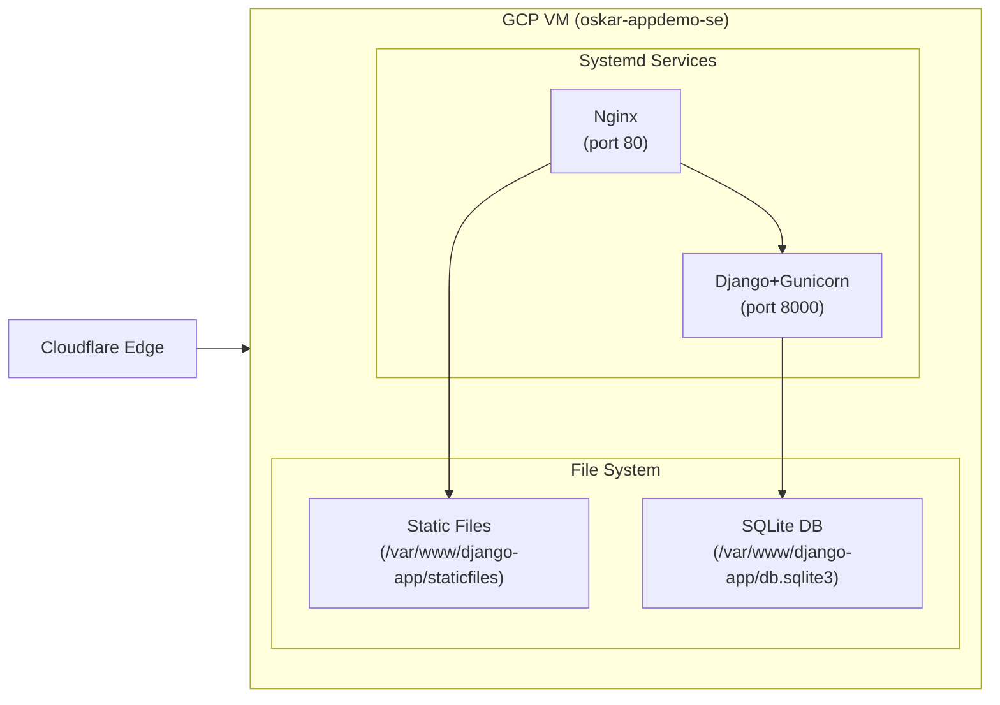

## End-to-End Traffic Flow: Browser → Cloudflare → Nginx → Django (Gunicorn) → SQLite

This document explains the full request path for `https://appdemo.oskarcode.com`, what each hop does, key headers, how to test each segment, and how to troubleshoot issues at every layer.

### Architecture Diagram (Mermaid)
```mermaid
sequenceDiagram
    autonumber
    participant B as Browser
    participant CF as Cloudflare Edge (WAF/CDN)
    participant VM as GCP VM (Origin)
    participant N as Nginx (systemd)
    participant W as Django+Gunicorn (systemd)
    participant DB as SQLite

    B->>CF: 1. HTTPS request (TLS at Cloudflare)
    CF-->>B: 2. Apply WAF/CDN, send response or forward
    CF->>N: 3. HTTP request to origin (X-Forwarded-*, CF-Connecting-IP)
    Note over VM: Port 80 open; Nginx routes to Gunicorn
    N->>W: 4. Proxy to 127.0.0.1:8000 (Gunicorn)
    W->>DB: 5. ORM query (SQLite file)
    DB-->>W: 6. Result rows
    W-->>N: 7. Django response
    N-->>CF: 8. Proxied response
    CF-->>B: 9. Final HTTPS response (HTTP/2)
```

### ASCII Overview
```
Browser ──TLS──> Cloudflare (DNS/WAF/CDN) ──HTTP──> Origin IP
                                          │
                                          ▼
                                  [GCP VM: Traditional Deployment]
                                          │
                                          ├─ Nginx (systemd service, port 80)
                                          │      │ proxy_pass http://127.0.0.1:8000
                                          │      ▼
                                          └─ Django+Gunicorn (systemd service)
                                                 │ ORM
                                                 ▼
                                              SQLite (local file)
```

---

## Traditional Deployment Architecture

### Service Topology (Mermaid)

#### Node Test Callouts
- Browser/Client:
  - `curl -Iv https://appdemo.oskarcode.com/`
- Cloudflare DNS/Edge:
  - `dig +short appdemo.oskarcode.com`
  - Check `cf-ray` in response headers
- Nginx service (origin entry):
  - `curl -I http://34.86.12.252/health/`
  - `sudo nginx -t`
- Nginx → Django upstream:
  - `curl -I http://127.0.0.1:8000/health/`
- Django+Gunicorn service:
  - `curl -I http://localhost:8000/health/`
  - `sudo systemctl status django-app`
- SQLite database:
  - `ls -la /var/www/django-app/db.sqlite3`
  - `sudo chown oskarablimit:oskarablimit /var/www/django-app/db.sqlite3`

### Service Configuration
- **nginx**: Reverse proxy serving `/static/` and forwarding dynamic requests to `127.0.0.1:8000`.
- **django-app**: Gunicorn app server running Django, listening on port 8000 via systemd.

Defined in systemd services:
- `/etc/systemd/system/django-app.service` → Django+Gunicorn service
- `/etc/nginx/nginx.conf` → Nginx configuration

### File System Layout
- Application files: `/var/www/django-app/`
- Static files: `/var/www/django-app/staticfiles/`
- Database: `/var/www/django-app/db.sqlite3`
- Virtual environment: `/var/www/django-app/venv/`

### Service Management
- Start: `sudo systemctl start django-app nginx`
- Stop: `sudo systemctl stop django-app nginx`
- Status: `sudo systemctl status django-app nginx`
- Logs: `sudo journalctl -u django-app` and `sudo tail -f /var/log/nginx/access.log`
- Health:
  - App: `curl -I http://localhost/health/` (nginx)
  - Direct: `curl -I http://localhost:8000/health/` (Django)

### Traditional Deployment Troubleshooting
- **Port conflicts**: `sudo ss -lntp | grep ':80\|:8000'`
- **Permissions (SQLite)**:
  - Ensure ownership: `sudo chown oskarablimit:oskarablimit /var/www/django-app/db.sqlite3`
  - Validate writes: `cd /var/www/django-app && source venv/bin/activate && python manage.py migrate --check`
- **Network reachability**:
  - From nginx to Django: `curl -I http://127.0.0.1:8000/health/`
- **Restart after config changes**: `sudo systemctl restart django-app nginx`
- **Environment verification**: `cd /var/www/django-app && source venv/bin/activate && env | sort | grep -E 'DEBUG|ALLOWED_HOSTS|SECRET_KEY'`

---

### 1) Browser / Client
- Role: Initiates HTTPS request to `appdemo.oskarcode.com`.
- Key behavior: Uses DNS to resolve domain. Sends TLS handshake and HTTP request.
- Test:
  - Basic: `curl -Iv https://appdemo.oskarcode.com/`
  - With headers: `curl -sI https://appdemo.oskarcode.com/ -H "User-Agent: test-agent"`
- Troubleshoot:
  - DNS: `nslookup appdemo.oskarcode.com` or `dig appdemo.oskarcode.com +short`
  - TLS: `echo | openssl s_client -connect appdemo.oskarcode.com:443 -servername appdemo.oskarcode.com`

### 2) DNS (Cloudflare DNS)
- Role: Resolves `appdemo.oskarcode.com` to Cloudflare anycast IP (orange cloud proxy enabled).
- What it does: Returns Cloudflare edge IP; shields origin IP; allows WAF/CDN/proxy features.
- Test:
  - `dig +short appdemo.oskarcode.com` → returns Cloudflare IP (not origin IP)
  - Confirm proxied (orange cloud) in Cloudflare DNS UI.
- Troubleshoot:
  - Propagation delays: `dig @1.1.1.1 appdemo.oskarcode.com`
  - Wrong record: Ensure A/AAAA point to origin IP and are proxied.

### 3) Cloudflare Edge (TLS termination, WAF, CDN, Bot/Rate Limits)
- Role:
  - Terminates HTTPS (presents cert to clients).
  - Applies WAF managed rules (e.g., block sensitive paths, SQLi patterns).
  - Optionally caches static responses (configured by headers).
  - Forwards request to origin with `CF-Connecting-IP`, `X-Forwarded-Proto`, `CF-Ray` headers.
- Notable headers from Cloudflare:
  - `CF-Ray`: Unique request identifier at edge.
  - `CF-Connecting-IP`: Original client IP.
  - `CF-Visitor`: JSON with scheme (http/https).
- Test:
  - WAF managed rules:
    - `curl -I https://appdemo.oskarcode.com/.env.backup/`
    - `curl -I https://appdemo.oskarcode.com/git-secrets/`
    - `curl -I "https://appdemo.oskarcode.com/search?q=test' OR '1'='1"`
  - Observe `cf-ray` and status codes.
- Troubleshoot:
  - WAF false positives: Review Security → Events in Cloudflare dashboard using `cf-ray` ID.
  - SSL mode: Use "Full" or "Full (Strict)" for origin HTTPS (we currently serve HTTP at origin; Full is okay if CF→origin is HTTP; Strict requires valid origin cert over HTTPS).

### 4) Origin VM Network (GCP VM: `oskar-appdemo-se`)
- Role: Receives Cloudflare-to-origin traffic on port 80.
- Security: Only 80/443 should be open publicly (prefer Cloudflare allowlist if feasible).
- Test:
  - From local: `curl -svo /dev/null https://appdemo.oskarcode.com/ --resolve appdemo.oskarcode.com:443:ORIGIN_IP`
  - From VM: `curl -I http://localhost/health/`
- Troubleshoot:
  - Firewall rules: Check GCP VPC firewall.
  - Process listening: `sudo ss -lntp | grep ':80'`

### 5) Nginx (Container) on VM
- Role: Reverse proxy; serves `/static/` and proxies dynamic requests to Gunicorn (`web:8000`).
- Relevant config: `nginx.conf`
  - `server_name appdemo.oskarcode.com 34.86.12.252;`
  - Static: `location /static/ { alias /var/www/static/; }`
  - Proxy: `location / { proxy_pass http://django; ... }`
  - Health: `location /health/ { return 200 "healthy\n"; }`
- Test:
  - From VM: `docker-compose exec -T nginx nginx -t`
  - Endpoint: `curl -I http://localhost/health/` (returns 200 from Nginx)
  - Static: `curl -I http://localhost/static/admin/css/base.css`
- Troubleshoot:
  - Logs: `docker-compose logs nginx`
  - Config errors: `nginx -t` inside container; restart: `docker-compose restart nginx`
  - Upstream reachability: `docker-compose exec -T nginx wget -qO- http://web:8000/health/`

### 6) Upstream to Django (Gunicorn) in `web` container
- Role: Nginx forwards to upstream `web:8000` (Gunicorn running Django).
- Gunicorn cmd (Dockerfile/compose): binds on `0.0.0.0:8000`.
- Test:
  - From host via Docker: `docker-compose exec -T web curl -I http://localhost:8000/health/` (200 OK)
  - Compare with Nginx health to confirm proxy path works end-to-end.
- Troubleshoot:
  - Logs: `docker-compose logs web`
  - Worker crashes/timeouts: Look for 500s/timeout logs; adjust workers/threads.
  - Env: `docker-compose exec -T web env | sort | head -n 50` to verify `ALLOWED_HOSTS` etc.

### 7) Django Application Layer
- Role: URL routing, views, templates, middleware, static collection.
- Notable endpoints:
  - `/` homepage
  - `/search/` search (used for WAF SQLi tests)
  - `/git-secrets/` and `/.env.backup/` fake sensitive endpoints
  - `/health/` JSON health (Django view; separate from Nginx health)
- Test:
  - `docker-compose exec -T web curl -sI http://localhost:8000/git-secrets/`
  - `docker-compose exec -T web curl -sI http://localhost:8000/.env.backup/`
  - `docker-compose exec -T web python manage.py check`
  - Migrations: `docker-compose exec -T web python manage.py migrate --check`
- Troubleshoot:
  - 400 Bad Request: Ensure `ALLOWED_HOSTS` includes domain/IP (in compose/env).
  - 500s: `docker-compose logs web` for Python tracebacks.

### 8) Database (SQLite)
- Role: Stores data in `db.sqlite3` on host bind mount.
- Path: in repo root; owned by UID 1000 to match `appuser` inside container.
- Test:
  - Connectivity: Health view hits simple `SELECT 1`.
  - Migrations: `docker-compose exec -T web python manage.py migrate`
  - Data seed: `docker-compose exec -T web python manage.py populate_products`
- Troubleshoot:
  - "unable to open database file" or "readonly database":
    - Ensure ownership: `sudo chown -R 1000:1000 /home/oskar/cloudflare-demo-ecommerce`
    - Validate mount path in `docker-compose.yml`.

### 9) Static/Media Files
- Role: Served by Nginx from volumes `static_volume`, `media_volume`.
- Collection: `python manage.py collectstatic --noinput` during `docker-compose up`.
- Test:
  - `curl -I http://appdemo.oskarcode.com/static/admin/css/base.css`
- Troubleshoot:
  - Missing: rerun collectstatic; check volume mounts in compose.

---

## Request Flow Summary
1. Browser resolves `appdemo.oskarcode.com` via Cloudflare DNS.
2. Browser establishes TLS with Cloudflare edge (cert at CF).
3. Cloudflare applies WAF/bot/CDN logic; forwards to origin with original IP in `CF-Connecting-IP`.
4. Origin VM receives request on port 80 → Nginx container.
5. Nginx serves `/static/` or proxies others to upstream `web:8000` (Gunicorn).
6. Gunicorn hands request to Django, which processes and may read/write SQLite.
7. Response flows back: Django → Gunicorn → Nginx → Cloudflare → Client.

---

## How to Verify Each Hop (Checklist)
- DNS: `dig +short appdemo.oskarcode.com` → Cloudflare IP
- TLS: `curl -Iv https://appdemo.oskarcode.com/` → HTTP/2 200 (Cloudflare)
- WAF: `curl -I https://appdemo.oskarcode.com/.env.backup/` → 200 from Django if not blocked; expect Cloudflare block when WAF rule enabled
- Nginx health: `curl -I http://ORIGIN_IP/health/` (200 healthy)
- Upstream: `docker-compose exec -T nginx wget -qO- http://web:8000/health/` (shows JSON or OK)
- Django health: `docker-compose exec -T web curl -s http://localhost:8000/health/`
- DB: `docker-compose exec -T web python manage.py dbshell` (optional)

---

## Troubleshooting by Layer
- Client:
  - DNS mismatch or stale cache → `dig` against 1.1.1.1 and 8.8.8.8
  - SNI/TLS errors → check certificate chain with `openssl s_client`
- Cloudflare:
  - 403/5xx with `cf-ray` → check Cloudflare Security → Events
  - SSL mode wrong → set to Full or Full (Strict) appropriately
- VM/Network:
  - Port closed → GCP firewall rules
  - Service down → `docker-compose ps`, `docker-compose logs`
- Nginx:
  - Config errors → `nginx -t` in container
  - Upstream errors (502/504) → verify `web:8000` reachability
- Django/Gunicorn:
  - 400 Bad Request → `ALLOWED_HOSTS`
  - 500 errors → view logs; run `manage.py check`
- SQLite:
  - Permission errors → ensure ownership UID 1000 on project dir and db file

---

## Useful Headers to Inspect
- From Cloudflare to origin (visible at Django if passed through):
  - `CF-Connecting-IP`: original client IP
  - `X-Forwarded-For`: chain of proxies
  - `X-Forwarded-Proto`: http/https
  - `CF-Ray`: request ID for CF troubleshooting

Check headers at Nginx: `docker-compose logs nginx` with access log enabled, or at Django by temporarily logging `request.headers` for debugging (do not keep in production).

---

## Quick Command Suite
```bash
# External checks
curl -I https://appdemo.oskarcode.com/
curl -I https://appdemo.oskarcode.com/health/

# From VM host
curl -I http://localhost/health/

# Inside nginx container
docker-compose exec -T nginx nginx -t
docker-compose exec -T nginx wget -qO- http://web:8000/health/

# Inside web container
docker-compose exec -T web curl -I http://localhost:8000/health/
docker-compose exec -T web curl -I http://localhost:8000/.env.backup/

# Logs
docker-compose logs nginx | tail -n 200
docker-compose logs web | tail -n 200
```
